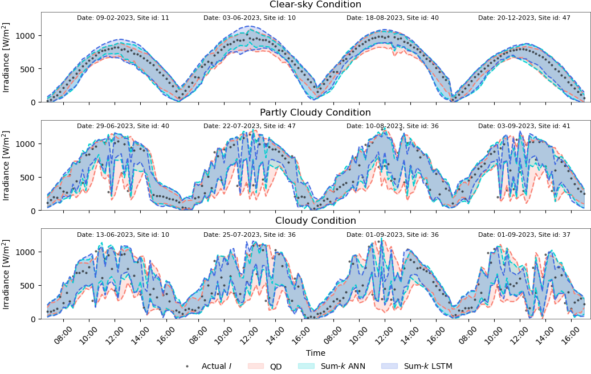

# Large width penalization for neural network-based prediction interval estimation
This GitHub repository contains the code used for the solar data experiments described in the article "Large Width Penalization for Neural Network-Based Prediction Interval Estimation."
## Citation
```
@misc{amnuaypongsa2024largewidthpenalizationneural,
      title={Large width penalization for neural network-based prediction interval estimation}, 
      author={Worachit Amnuaypongsa and Jitkomut Songsiri},
      year={2024},
      eprint={2411.19181},
      archivePrefix={arXiv},
      primaryClass={cs.LG},
      url={https://arxiv.org/abs/2411.19181}, 
}
```
Contact: `worachitam@gmail.com`
## Abstract
Forecasting accuracy in highly uncertain environments is challenging due to the stochastic nature of such systems. Deterministic forecasting, which provides only point estimates, is insufficient to capture potential outcomes. Therefore, probabilistic forecasting has gained significant attention due to its ability to quantify uncertainty, where one of the approaches is to express it as a prediction interval (PI), that explicitly shows upper and lower bounds of predictions associated with a confidence level. High-quality PI is characterized by a high PI coverage probability (PICP) and a narrow PI width. In many real-world applications, the PI width is generally used in risk management to prepare resources that improve reliability and effectively manage uncertainty. A wider PI width results in higher costs for backup resources as decision-making processes generally focus on the worst-case scenarios arising with large PI widths under extreme conditions. This study aims to reduce the large PI width from the PI estimation method by proposing a new PI loss function that penalizes the average of the large PI widths more heavily. Additionally, the proposed formulation is compatible with gradient-based algorithms, the standard approach to training neural networks (NNs), and integrating state-of-the-art NNs and existing deep learning techniques. Experiments with the synthetic dataset reveal that our formulation significantly reduces the large PI width while effectively maintaining the PICP to achieve the desired probability. The practical implementation of our proposed loss function is demonstrated in solar irradiance forecasting, highlighting its effectiveness in minimizing the large PI width in data with high uncertainty and showcasing its compatibility with more complex neural network models. Therefore, reducing large PI widths from our method can lead to significant cost savings by over-allocation of reserve resources.

## Formulation description
The proposed formulation is called the Sum-k formulation, which can be shown as
```math
\begin{equation}
	\mathcal{L}_{\text{sum}-k}(\theta) = \max(0, (1-\delta) - \text{PICP}(\theta)) + \gamma \frac{1}{R_{\text{quantile}}} \left [ \frac{1}{K} \sum_{i=1}^{K} w_{[i]}(\theta) + \lambda \cdot \frac{1}{N-K} \sum_{K+1}^{N} w_{[i]}(\theta) \right ],
\end{equation}
```
where $w_{[i]}$ is the $i^{\mathrm{th}}$ largest PI width element, with $w_{[1]} \geq w_{[2]} \geq \cdots \geq w_{[N]}$.

## Forecasting specification
We aim to deliver the one-hour-ahead solar irradiance forecast PI from 07:00 to 17:00 with a
confidence level of 0.9 at a 15-minute resolution, corresponding to 4 lead times. This forecasted PI indicates the uncertainty
in solar energy, assisting system operators in decision-making for better reserve preparation and generation planning.

An example of the timeseries plot of PI from the Sum-k formulation is illustrated below.
<p align="center">
  
</p>

## Repository
This repository is structured as follows:
```
|-- utils
|   |-- formulations.py
|   |-- networks.py
|   |-- trainer.py
|-- experiment
|   |-- result
|-- paper_figure
|   |-- visualization.ipynb
|   |-- saved_figures
|-- data
|   |-- preprocessing.ipynb
```
- `utils` folder consists of `.py` files that define the loss function, neural network architecture, and training algorithms.
	- `formulation.py` consists of all loss functions used in this study, including our formulation.
	- `networks.py` consists of a neural network model structure
	- `trainer.py` includes a training algorithm, evaluation metrics calculation, and result plots generation.
- `experiment` includes all experiment corresponding codes and datasets utilized in Section 6 of the article.
- The `paper_figure` folder contains the figures used in this article along with the code for generating them ([**visualization.ipynb**](./paper_figure/visualization.ipynb)).
- `data` folder consists of the dataset using in the experiment as  .csv and .pkl format.
	- [**preprocessing.ipynb**](./data/preprocessing.ipynb)) 

